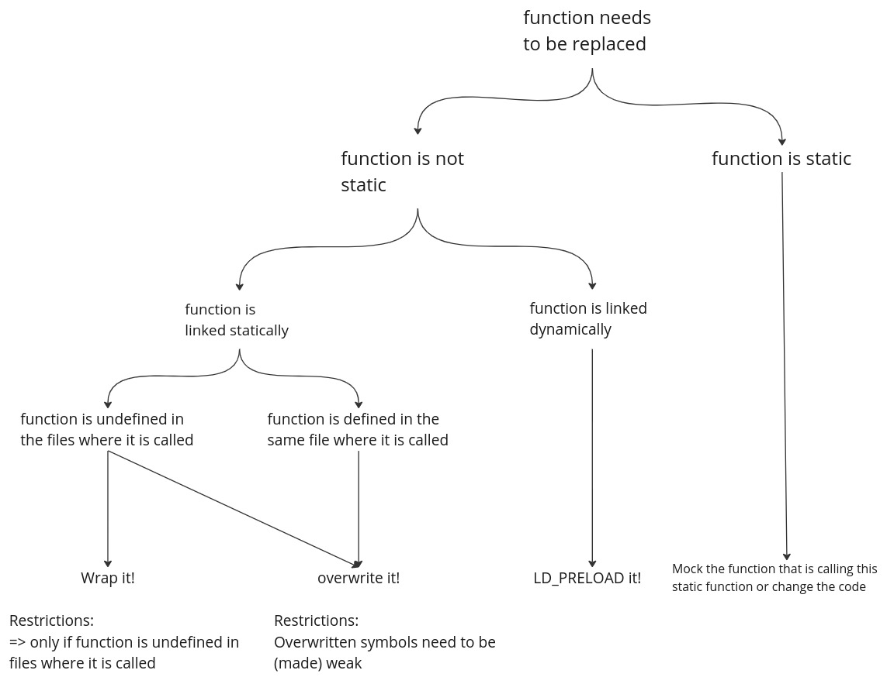

# Mocking Examples
This folder contains a collection of mocking examples.
Three main techniques are shown:
- Wrapping functions
- LD_PRELOADing functions
- Overwriting functions

The following decision tree can help to decide which technique might be applicatble:


## Building
From the src directory create a build directory and build everything with cmake:
```
mkdir build && cd build
cmake ..
make
```

## Running
The examples can be executed like this:
```
./wrapping_example
LD_PRELOAD=libld_preload_mocks.so ./ld_preload_example
./overwriting_example
```
